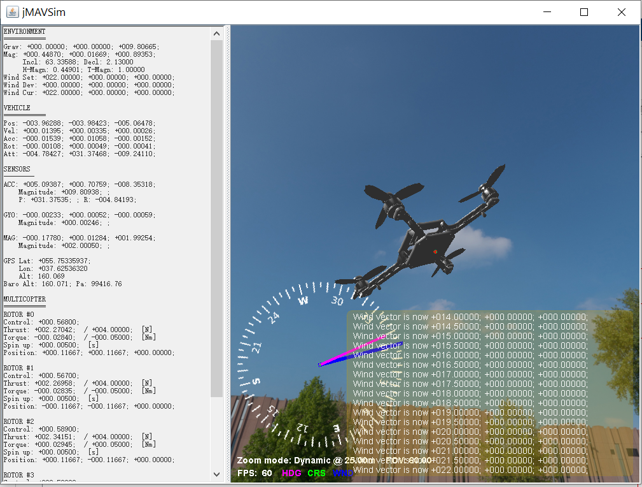
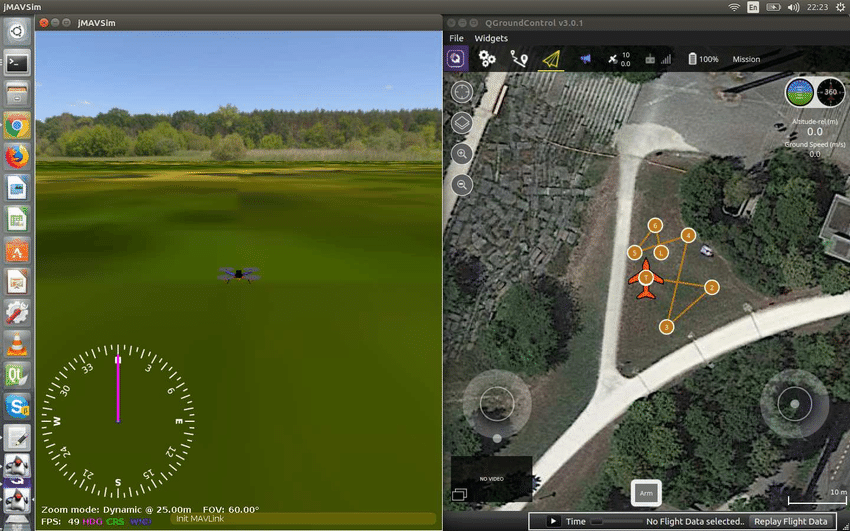
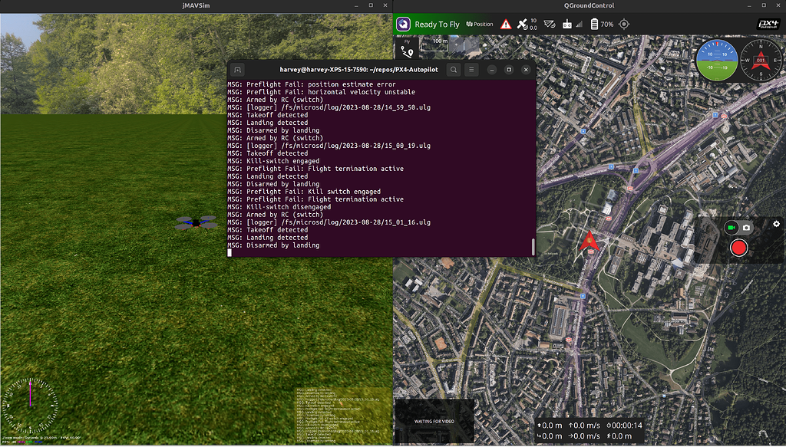
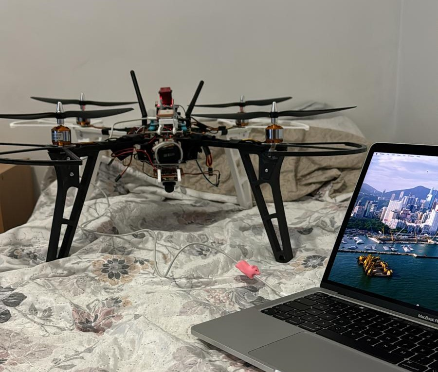

<h1 align="center">Module Part of Oroneta Project</h1>
<br>
<br>

<p align="center">
  <i>API, Manager and AI of the drone</i>
</p>

<p align="center">
  <a href="./CONTRIBUTING.md">Contributing</a>
  ·
  <a href="https://github.com/oroneta/drone-module/issues">Issues</a>
</p>

<p align="center">
  <a href="https://opensource.org/license/mit">
    
  </a>&nbsp;
  <a>
    
  </a>
</p>

<hr>

## Table of Contents

- [Introduction](#introduction)
- [Features](#features)
- [Installation](#installation)
- [Usage](#usage)
  - [API](#api)
  - [Manager](#manager)
  - [AI](#ai)
- [Testing](#testing)


## Introduction

This module is part of the Oroneta project, which is a drone that is capable of flying autonomously and performing tasks such as monitoring, surveillance, and data collection. This module is responsible for the API, Manager, and AI of the drone. The API is responsible for receiving requests from the user and sending them to the manager. The manager is responsible for managing the drone's movements and tasks. The AI is responsible for processing the data collected by the drone and making decisions based on it.


## Features

- **API**: The API is responsible for receiving requests from the user and sending them to the manager.
- **Manager**: The manager is responsible for managing the drone's movements and tasks.
- **AI**: The AI is responsible for processing the data collected by the drone and making decisions based on it.


## Installation

To install the module, you need to clone the repository and install the dependencies.

```bash
git clone https://github.com/oroneta/drone-module
cd drone-module

# Deploy the module
cd docker
docker-compose up -d
```

## Usage

### API

This main part is builded with Express.js with node,js. This is the API list of endpoints:

**Every endpoint must include the auth token in the headers** Example: `Authorization: Brearer ${token}

- **GET** `/metadata/:data/:dic`: Get the metadata of the type of data
  
           * `data`: The type of data (e.g. all, battery, gps, etc.)
           * `dic`: The device id code

           * Example: `metadata/all/ESP00001-123-0033` - `Authorization: Bearer 0`
           * Example: `metadata/all/ESP00001-123-0033;ESP00002-123-0033` - `Authorization: Brearer 0;1`

- **GET** `/status/:dic`: Get the status of the device
  
           * `dic`: The device id code

           * Example: `status/ESP00001-123-0033` - `Authorization: Bearer 0`
           * Example: `status/ESP00001-123-0033;ESP00002-123-0033` - `Authorization: Brearer 0;1`


- **GET** `/routes/:dic`: Get the route assigned to the device
  
           * `dic`: The device id code

           * Example: `routes/ESP00001-123-0033` - `Authorization: Bearer 0`
           * Example: `routes/ESP00001-123-0033;ESP00002-123-0033` - `Authorization: Brearer 0;1`
    
- **POST** `/routes/:dic`: Assign a route to the device
  
            * `dic`: The device id code
            * `body`: The route to assign
    
            * Example: `routes/ESP00001-123-0033` - `Authorization: Bearer 0` - `body: { "type": "waypoint", "coord": [[0,0], [1,2]] }`

- **GET** `/alarm/:dic`: Get the alarm assigned to the device

- **DELETE** `/alarm/:dic`: Delete the alarm assigned to the device

- **GET** `/alarm/image/:image`: Get the image of the alarm
  
            * `image`: The image key received after calling "/alarm/:dic"

            * Example: `alarm/image/ESP00001-123-0033` - `Authorization: Bearer


### Manager

To use the manager, you will need to install any Mavlink client with drone module (e.g. QGroundControl) and connect to the drone. The manager will be responsible for managing the drone's movements and tasks.








Or use any phisical drone with Ardupilot and configuration to connect to Manager server `port 60002`. Any information about the configuration of the drone can be found in the [Ardupilot documentation](https://ardupilot.org/ardupilot/index.html). Or following our repository [Oroneta Drone QinNiao QN001](https://github.com/oroneta/QN001-drone)




### AI

The AI include their own set of API endpoints to manage the AI. The AI is responsible for processing the data collected by the drone and making decisions based on it.

**Every endpoint must include the auth token in the headers** Example: `Authorization: Brearer ${token}

- **POST** `/:dic`: Send the data of the device

           * `dic`: The device id code
           * `body`: The data of the image

           * Example: `data/ESP00001-123-0033` - `Authorization: Bearer 0` - `body: ${Image/raw}`


Video of the AI in action:


# Testing

Every part of the module has their own test. To run the test you need to run the following command.

